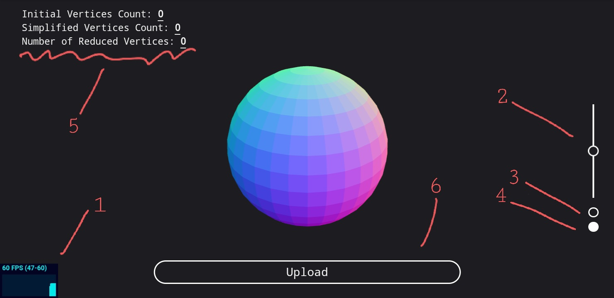

# Mesh Simplification v5 | by MKebsi
A [Threejs-based](https://threejs.org/) mesh simplification viewr.

[Online Demo](https://mesh-simplification.vercel.app/)

## Usage
First thing to see is a sphere rotating around the scene.

Everything label in the image is desciped below. 

### 1 - FPS Meter
This is an FPS meter to tell you how fast is the app. 60fps is more than amazing, but at some screens, It may go to 120fps or more.

You can click on it to show other types of useful metters.

### 2 - Slider
This one is there to reduce the LOD dynamically. Changing this option will freeze the viewer for a moment.

There are only three levels. At the top, you will get the cleanest model but at the worst persormance. In the middle, you will be at a very good spot of performance and clarity. At the bottom, it will have the best performance, but the model may get deformed.

### 3 - Smooth Shading
This is a checkbox that will change the shading of the model. Default is flat-shading.

### 4 - Auto Rotate
You will clearly notice that the model is rotating around its center. That may grow annoying with time, so this check will stop it!

### 5 - Logs
In this section, you will see the initial model's vertices count, the new simplified mesh's vertices count, and finally, how many vertices were deleted.

This will dynamically change with the slider.

### 6 - Upload 
Click on it of you are on mobile. You can click on it too if you are on PC, but you better drag and drop your files into the browser. 

### Double Click
You can double click anywhere to view it in fullScreen mode

### Navigation
You can pan, zoom, and truck around the scene with you mouse left click, wheel, and right click. So simple that you will figure it out in minutes. 

## Supported Formats
- obj
- stl
- ply
- gltf/glb

Buggy, yet may work
- usd/usdz
- fbx
