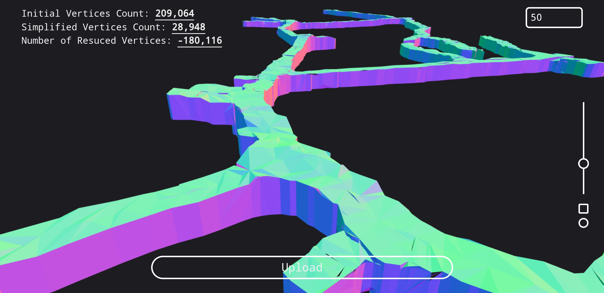
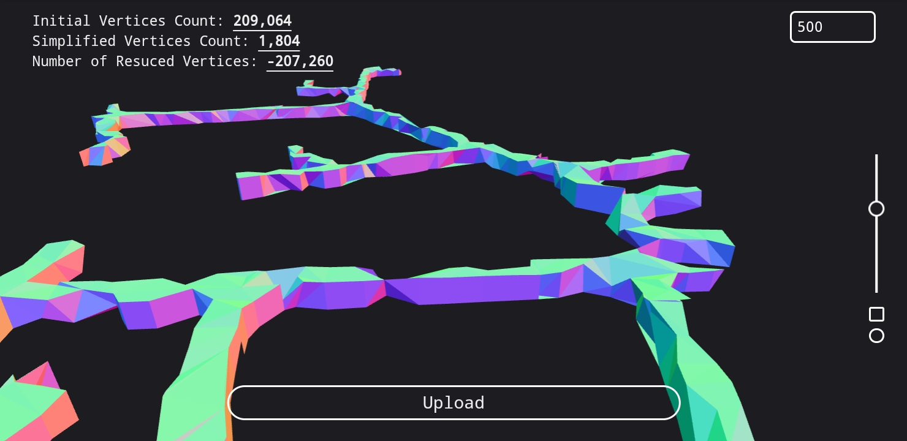
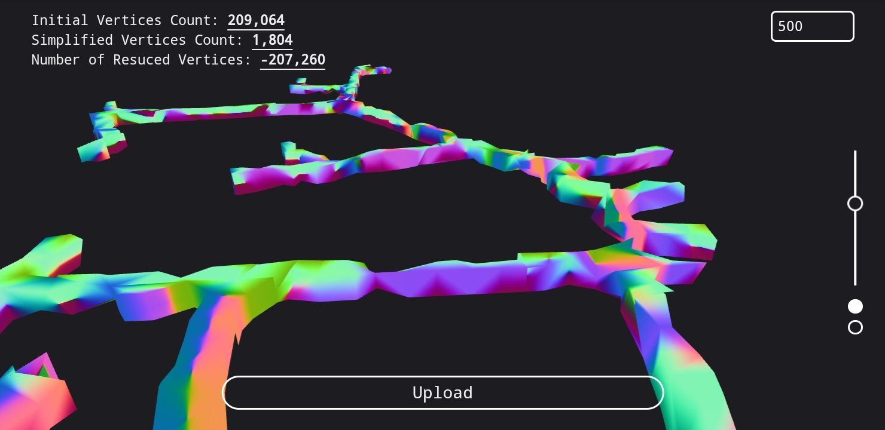
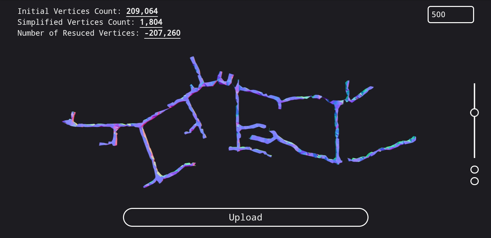

# Mesh Simplification v3 | by MKebsi
A [Threejs-based](https://threejs.org/) mesh simplifier.

But before anything, check it out!
[Online Demo](https://mesh-simplification.vercel.app/)
<<<<<<< HEAD
=======

The example uses a `MeshNormalMaterail()` to show specifically all edges of the mesh so that artifacts will be easily detected during the process. The top-right panel may also feel a bit stiff, yet that is duo to time limitations.

This was all created in two days (starting Jun 5 until Jun 7, 2024), 2-4 hours per day. A day before that was spent on researching and concepting.
>>>>>>> ab01bcc60df41dfd17641c6f028dad869a5ed44e

## Usage
First thing to see is a sphere. 

The numbers (in red) are labeled below:

### 1 - Multipler
This will set the maximum value for the slider (below). The formula for the model resolution is `25e-4 * Multipler * (slider's value / 100) + 1e-10`

The initial `25e-4` was the best value for the models I tested, yet that depends on how big the model is. The slider's value is divided by 100 to have a percentage of the initial value.

Moreover, `1e-10` or `0.0000000001` is there to prevent the value to go to zero.

> [!Note]
> If your model is big, crank this number up then play with the slider and vice versa.

### 2 - Slider
This one is there to reduce the LOD dynamically. Changing this option will freeze the viewer for a moment.

Going up, you will get closer to 0. The value below is defaulted to `5e-2` but that will change once you play with the Multipler (Number 1).

### 3 - Smooth Shading
This is a checkbox that will change the shading of the model. Default is flat-shading.

### 4 - Auto Rotate
You will clearly notice that the model is rotating around its center. That may grow annoying with time, so this check will stop it!

### 5 - Logs
In this section, you will see the initial model's vertices count, the new simplified mesh's vertices count, and finally, how many vertices were deleted.

This will dynamically change with the slider.

### 6 - Upload 
Click on it of you are on mobile. You can click on it too if you are on PC, but you better drag and drop your files into the browser. 

### Double Click
You can double click anywhere to view it in fullScreen mode

### Navigation
You can pan, zoom, and truck around the scene with you mouse left click, wheel, and right click. So simple that you will figure it out in minutes. 

## Supported Formats
- obj
- stl
- gltf/glb

Ability to expand the support for...
- usd/usdz
- ply
- drc (glb draco)
- dxf (based on https://github.com/gdsestimating/three-dxf)

## Extra Screenshots 

